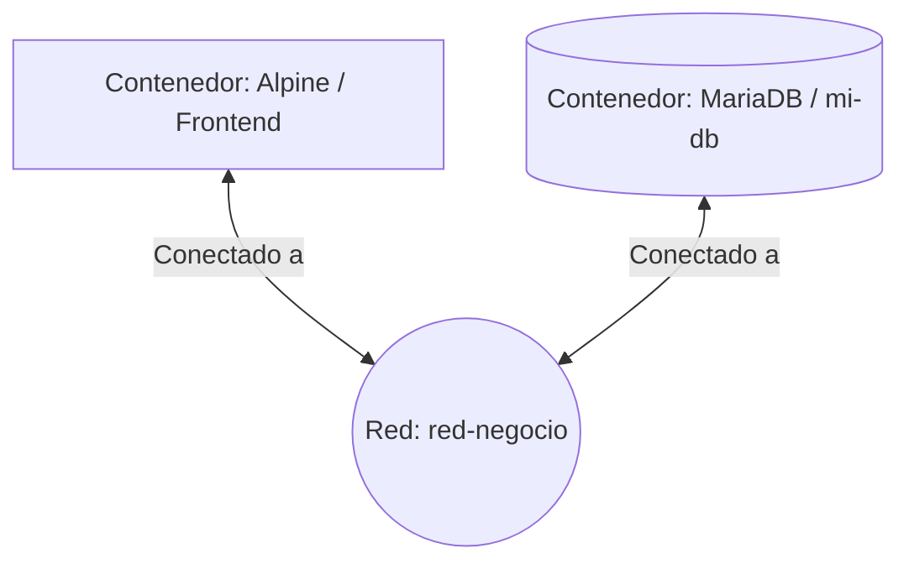

# Laboratorio-16-y-Persistencia-en-Docker
Evidencia práctica de Networking Lógico y manejo de datos en Docker. Demuestra la capacidad para aislar entornos con Redes Definidas por Software (SDN), comunicar microservicios mediante DNS interno y garantizar la integridad de la información usando volúmenes en bases de datos (MariaDB).
## 1. Topología del Laboratorio
A continuación, se presenta el diagrama de la arquitectura lógica implementada, donde los contenedores se comunican a través de una Red Definida por Software (SDN): 

2. Comandos Utilizados
A continuación, se detallan los comandos ejecutados durante la práctica para cumplir con los objetivos de microsegmentación y persistencia de datos:
Fase 1: Redes y DNS Interno
  docker network create red-negocio
  docker run -d --name mi-db --network red-negocio -e MYSQL_ROOT_PASSWORD=secreto mariadb:latest
  docker run -it --rm --network red-negocio alpine ash
  ping mi-db

Fase 2: Volúmenes y Persistencia
  docker run -d --name db-error -e MYSQL_ROOT_PASSWORD=secreto mariadb:latest
  docker exec -it db-error mariadb -u root -psecreto -e "CREATE DATABASE prueba_perdida;"
  docker rm -f db-error
  docker volume create mi-data-db
  docker run -d --name db-persistente -v mi-data-db:/var/lib/mysql -e MYSQL_ROOT_PASSWORD=secreto mariadb:latest
  docker exec -it db-persistente mariadb -u root -psecreto -e "CREATE DATABASE prueba_segura;"
  docker rm -f db-persistente
  docker run -d --name db-recuperado -v mi-data-db:/var/lib/mysql -e MYSQL_ROOT_PASSWORD=secreto mariadb:latest
  docker exec -it db-recuperado mariadb -u root -psecreto -e "SHOW DATABASES;"
  docker volume inspect mi-data-db

3. Reflexiones
Si borro la red red-negocio, ¿qué sucede con los contenedores que estaban conectados a ella?
Docker no permite borrar una red que esté en uso activo. Arrojará un error indicando que la red tiene "endpoints" (contenedores) activos. Para poder eliminarla, primero es necesario detener y eliminar los contenedores asociados a dicha red.

Reflexión sobre el uso de volúmenes en producción:
En entornos de producción, los volúmenes son críticos porque permiten desacoplar el ciclo de vida de los datos del ciclo de vida del contenedor. Esto garantiza que la información vital (como bases de datos) persista de manera segura, evitando pérdidas catastróficas incluso si el contenedor original se actualiza, se reinicia o se destruye accidentalmente.

