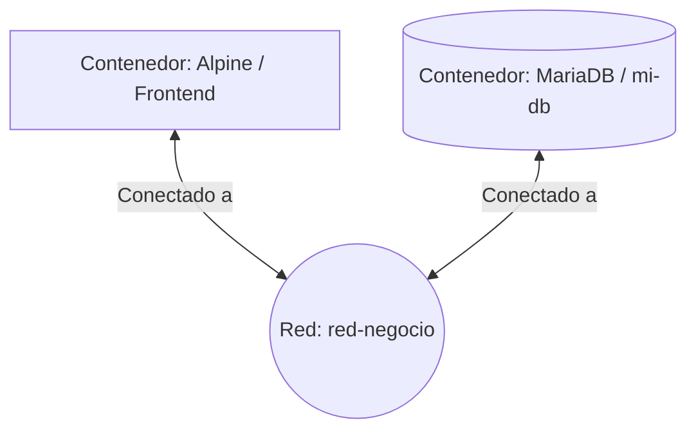

# Laboratorio 16 y Persistencia en Docker
Evidencia práctica de Networking Lógico y manejo de datos en Docker. Demuestra la capacidad para aislar entornos con Redes Definidas por Software (SDN), comunicar microservicios mediante DNS interno y garantizar la integridad de la información usando volúmenes en bases de datos (MariaDB).
1. Topología del Laboratorio
Se presenta el diagrama de la arquitectura lógica implementada, donde los contenedores se comunican a través de una Red Definida por Software (SDN): 

2. Comandos Utilizados
Se detallan los comandos ejecutados durante la práctica para cumplir con los objetivos de microsegmentación y persistencia de datos:
 
Fase 1: Redes y DNS Interno
  - docker network create red-negocio
  - docker run -d --name mi-db --network red-negocio -e MYSQL_ROOT_PASSWORD=secreto mariadb:latest
  - docker run -it --rm --network red-negocio alpine ash
  - ping mi-db

Fase 2: Volúmenes y Persistencia
  - docker run -d --name db-error -e MYSQL_ROOT_PASSWORD=secreto mariadb:latest
  - docker exec -it db-error mariadb -u root -psecreto -e "CREATE DATABASE prueba_perdida;"
  - docker rm -f db-error
  - docker volume create mi-data-db
  - docker run -d --name db-persistente -v mi-data-db:/var/lib/mysql -e MYSQL_ROOT_PASSWORD=secreto mariadb:latest
  - docker exec -it db-persistente mariadb -u root -psecreto -e "CREATE DATABASE prueba_segura;"
  - docker rm -f db-persistente
  - docker run -d --name db-recuperado -v mi-data-db:/var/lib/mysql -e MYSQL_ROOT_PASSWORD=secreto mariadb:latest
  - docker exec -it db-recuperado mariadb -u root -psecreto -e "SHOW DATABASES;"
  - docker volume inspect mi-data-db

3. Se muestra la captura de pantalla de la consola al ejecutar el comando docker volume inspect mi-data-db, donde se verifica la creación y la ruta física (Mountpoint) del volumen gestionado por Docker en el sistema:
   
   

4. Diferencia entre el Paso 1 (Simulación de Error) y el Paso 3 (Despliegue Resiliente)

Paso 1 (Sin Volúmenes - db-error):

En este paso, el ciclo de vida de la información está completamente acoplado al ciclo de vida del contenedor. Al crear la base de datos prueba_perdida y posteriormente ejecutar docker rm -f db-error, la información se destruyó permanentemente debido a la naturaleza efímera del contenedor. Al levantar un contenedor nuevo, la base de datos ya no existía.

Paso 3 (Con Volumen Gestionado - db-persistente): 

En este paso, el ciclo de vida de los datos se desacopla del contenedor. Al mapear el volumen mi-data-db a la ruta interna /var/lib/mysql, Docker redirige de manera lógica todas las escrituras de la base de datos hacia un directorio seguro en el disco duro del host. Por lo tanto, cuando destruimos el contenedor db-persistente y levantamos un contenedor completamente nuevo (db-recuperado) apuntando al mismo volumen, este último hereda la carpeta intacta, demostrando una infraestructura resiliente y tolerante a fallos.

5. Reflexiones
   
Si borro la red red-negocio, ¿qué sucede con los contenedores que estaban conectados a ella?

Docker no permite borrar una red que esté en uso activo. Arrojará un error indicando que la red tiene "endpoints" (contenedores) activos. Para poder eliminarla, primero es necesario detener y eliminar los contenedores asociados a dicha red.

Reflexión sobre el uso de volúmenes en producción:
En entornos de producción, los volúmenes son críticos porque permiten desacoplar el ciclo de vida de los datos del ciclo de vida del contenedor. Esto garantiza que la información vital (como bases de datos) persista de manera segura, evitando pérdidas catastróficas incluso si el contenedor original se actualiza, se reinicia o se destruye accidentalmente.

6. Investigación
¿Qué es la "Persistencia" y por qué los datos de un contenedor se borran si no usamos Volúmenes?

La persistencia es la propiedad de los datos de sobrevivir de manera permanente más allá del ciclo de vida del proceso o contenedor que los generó.

Por defecto, los contenedores de Docker son efímeros y utilizan un sistema de almacenamiento temporal llamado Writable Layer (capa de escritura). Cuando un contenedor escribe datos (como una base de datos de MariaDB), estos se guardan en esta capa delgada de lectura/escritura que pertenece exclusivamente a ese contenedor específico. En el momento en que el contenedor se destruye o se borra mediante el comando docker rm, su capa de escritura se elimina de forma automática e inmediata junto con él. Si no se utiliza un mecanismo externo como los Volúmenes para extraer esos datos y guardarlos directamente en el almacenamiento de la máquina host, la información se pierde de forma irreversible.

7. Anexos - Evidencias

Anexo 1: Comprobación de los datos recuperados

Descripción: Esta captura demuestra la persistencia de la información. Se observa la ejecución del comando SHOW DATABASES; dentro del nuevo contenedor (db-recuperado), confirmando que la base de datos prueba_segura sobrevivió intacta a la destrucción del contenedor original gracias a la implementación del volumen.

Anexo 2: Creación de la Red Definida por Software (SDN)

Descripción: Evidencia de la correcta configuración del entorno lógico. Mediante el comando docker network ls, se confirma que la red privada aislada (red-negocio) fue creada exitosamente y se encuentra activa en el motor de Docker para realizar la microsegmentación.

Anexo 3: Volumen gestionado visto desde Docker Desktop

Descripción: Verificación visual a través de la interfaz gráfica de usuario (GUI). Se comprueba que el volumen mi-data-db está siendo gestionado correctamente por Docker a nivel del host, listo para aislar el ciclo de vida de los datos del de las aplicaciones.

 
